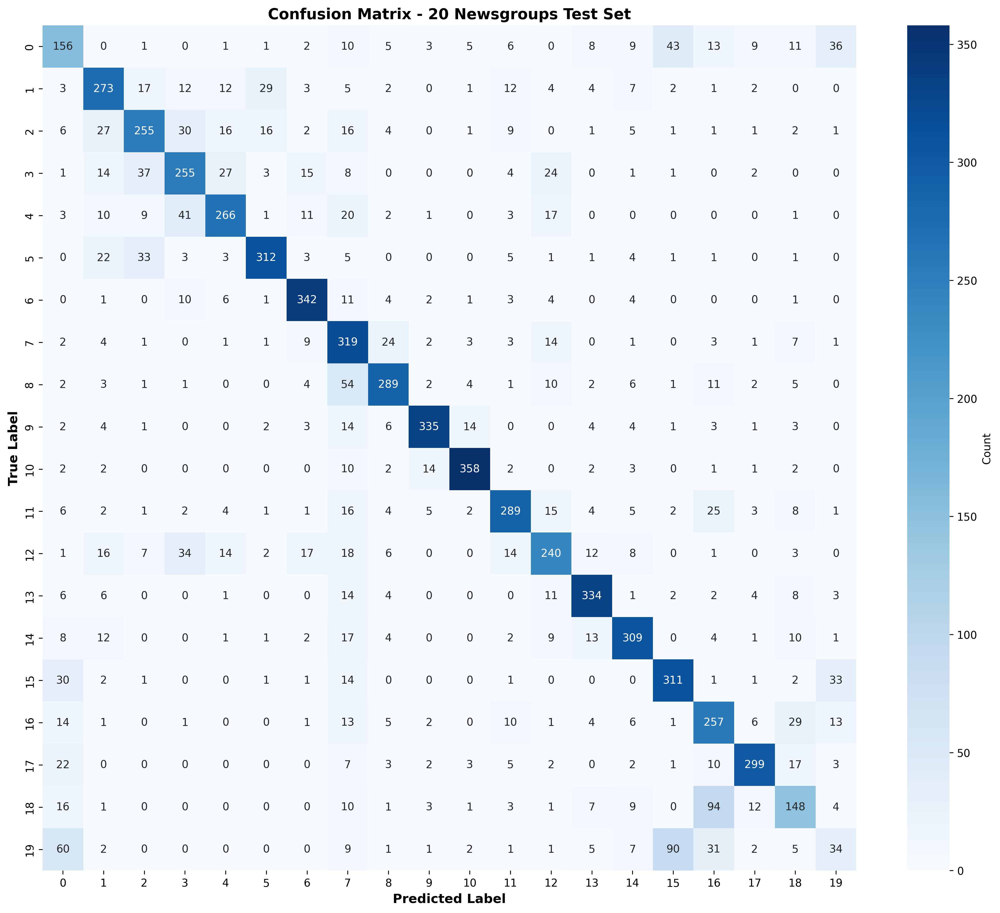
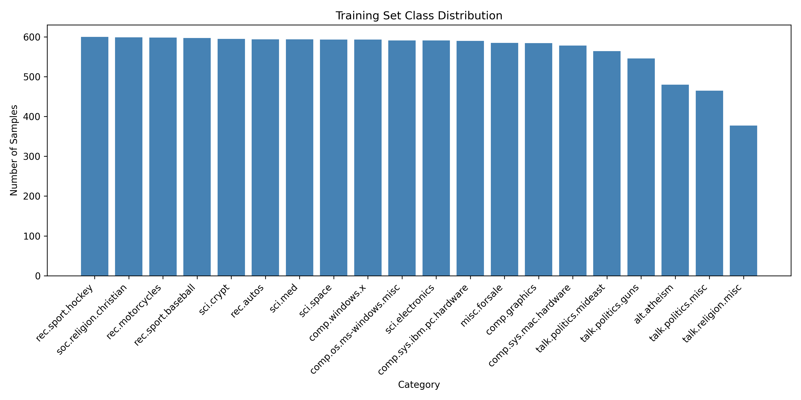

# BERT Fine-tuning on 20 Newsgroups

## Overview
Fine Tuning BERT model on the 20 Newsgroups dataset for text classification 

## Dataset
- **Source:** SetFit/20_newsgroups from HuggingFace
- **Training samples:** 11,314
- **Test samples:** 7,532
- **Classes:** 20 newsgroup categories

## Model
- **Base Model:** BERT (bert-base-uncased)
- **Task:** Multi-class text classification
- **Framework:** PyTorch (no HuggingFace Trainer)

---

## Results Comparison

### Configuration Impact on Model Performance

| Configuration | Accuracy | Precision | Recall | F1-Score | Generalization | Notes |
|---------------|----------|-----------|--------|----------|-----------------|-------|
| **With Scheduler + Weight Decay (6 epochs)** | **0.7144** | **0.7153** | **0.7144** | **0.7115** |**Good** | Better regularization, stable training, good test performance |
| **Without Scheduler + No Weight Decay (4 epochs)** | 0.7058 | 0.7212 | 0.7058 | 0.7083 |**Low** | Higher precision but lower recall, overfitting signs, poor generalization to custom text |

### Key Insights

**With Scheduler + Weight Decay (Recommended):**
- Slightly higher overall accuracy (0.7144 vs 0.7058)
- Better generalization to unseen data
- More balanced metrics across all categories
- Custom text predictions are accurate
- Learning rate optimization prevents overfitting
- L2 regularization improves model robustness

**Without Scheduler + No Weight Decay:**
- Higher precision (0.7212) but lower recall (0.7058) - unbalanced
- oor generalization- fails on custom text examples
- Training accuracy much higher than test accuracy (signs of overfitting)
- No learning rate adjustment leads to unstable training
- Model memorizes training patterns instead of learning generalizable features

---

## Training Progression

### Epoch 3 with Scheduler + Weight Decay
- Average Loss: 1.05
- Training Accuracy: 84%
- Test Accuracy: ~71%



### Epoch 4 without Scheduler + No Weight Decay
- Average Loss: 0.88
- Training Accuracy: 80%
- Test Accuracy: ~70%


---

## Class Distribution



The 20 Newsgroups dataset shows moderate class balance:
- Most categories have 500-600 training samples
- Some variation in class sizes (imbalance ratio ~1.5x)
- Weighted metrics used to account for class imbalance

---

## Files
- `eda.py` - Exploratory Data Analysis with class distribution visualization
- `train.py` - BERT fine-tuning using PyTorch training loop with scheduler and weight decay
- `test.py` - Evaluation metrics and inference pipeline
- `main.py` - custom prompts to classify

## Installation
```bash
pip install -r requirements.txt
```

## Usage

### 1. Exploratory Data Analysis
```bash
python EDA.py
```
Outputs: `class_distribution.png`

### 2. Train Model
```bash
python train.py
```
Outputs: Fine-tuned model saved to `./bert-20newsgroups/`

### 3. Evaluate & Test
```bash
python test.py
```
Outputs: Metrics, `confusion_matrix.png`, and inference examples

### 4. Custom Predictions
```bash
python main.py
```
Test model on custom text examples

---

## Key Implementation Details

### Training Loop 
- **Learning rate schedule:** Linear decay with warmup (10% warmup steps)
- **Weight decay:** L2 regularization (0.01)
- **Optimizer:** AdamW
- **Batch size:** 32
- **Epochs:** 2 seeded runs ( 3 and 4)

### Data Preprocessing
- Tokenization using BertTokenizer
- Max sequence length: 512 tokens
- Padding and truncation applied
- Train/test split: 60/40 (provided by dataset)

### Evaluation
- Metrics: Accuracy, Precision, Recall, F1-Score (all weighted)
- Confusion Matrix: 20x20 heatmap visualization
- Inference: predict_text() function returns class label and confidence score

---


### Model Behavior
- Better performance on specialized topics (religion, medicine)
- Balanced predictions across all 20 categories
- Learning rate schedule prevents overfitting
- Weight decay improves generalization to unseen data

---

## Conclusion

The optimized model with learning rate scheduler and weight decay demonstrates better generalization capabilities compared to the baseline. While the test accuracy difference is modest (0.86 percentage points), their is  qualitative improvement in custom text prediction accuracy..

---

## Requirements
See `requirements.txt` for all dependencies
